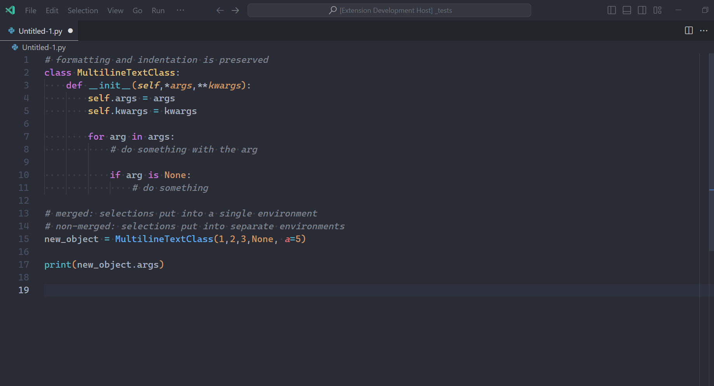

# code2latex
Ever wanted to include your code into a TeX document, but you're too lazy to relearn how to or format it properly so it displays exactly like you want it to?

`code2latex` provides simple shortcuts for you to get a preformatted and environment-wrapped version of your code. (currently using the `minted` latex package)

## Features

This extension provides two commands, which only really matter if you have muliple cursors (**for single cursor slections, both are equivalent**):
- **Get LaTeX code for selected text (non-merged):** If there are two or more selections, the text of each will be placed in separate `minted` environments.
- **Get LaTeX code for selected text (merged):** If there are two or more selections, all of their texts' will be placed in a single `minted` environment.

The extension preserves the whitespace and formatting of your code exactly as it is displayed in VSCode, without alteration.

The output LaTeX code is presented in a new editor window, where you can easily copy, edit and save the code as you would normally.

`code2latex` also detects the language of the current file and uses it for the environment (to see which languages are supported this way and which might need slight changes on your end, please refer to [the Pygments docs](https://pygments.org/languages/)),

To use the extension, select some text (multiple cursor selction supported as well), open the command panel (`Ctrl+Shift+P`), type in `code2latex` and select the command you'd like to use.

## Requirements

<!-- If you have any requirements or dependencies, add a section describing those and how to install and configure them. -->

While the extension itself doesn't have any requirements, to execute the generated TeX you'll need to have the `minted` package and its dependencies (primarily `pygmentize`) installed. Overleaf has this package preinstalled so the output from here should work there without modification.

## Extension Settings

There aren't any configurable settings at the moment, but there might be more options for formatting and color theming etc. in the future. (submit a PR if you'd like to!)
<!-- Include if your extension adds any VS Code settings through the `contributes.configuration` extension point.

For example:

This extension contributes the following settings:

* `myExtension.enable`: Enable/disable this extension.
* `myExtension.thing`: Set to `blah` to do something. -->
<!--
## Known Issues

Calling out known issues can help limit users opening duplicate issues against your extension. -->

## Release Notes

### 1.0.0

Initial release of `code2latex`

---
<!--
## Following extension guidelines

Ensure that you've read through the extensions guidelines and follow the best practices for creating your extension.

* [Extension Guidelines](https://code.visualstudio.com/api/references/extension-guidelines)

## Working with Markdown

You can author your README using Visual Studio Code. Here are some useful editor keyboard shortcuts:

* Split the editor (`Cmd+\` on macOS or `Ctrl+\` on Windows and Linux).
* Toggle preview (`Shift+Cmd+V` on macOS or `Shift+Ctrl+V` on Windows and Linux).
* Press `Ctrl+Space` (Windows, Linux, macOS) to see a list of Markdown snippets.

## For more information

* [Visual Studio Code's Markdown Support](http://code.visualstudio.com/docs/languages/markdown)
* [Markdown Syntax Reference](https://help.github.com/articles/markdown-basics/) -->

**Enjoy, and please leave a review if you find this useful! :)**
